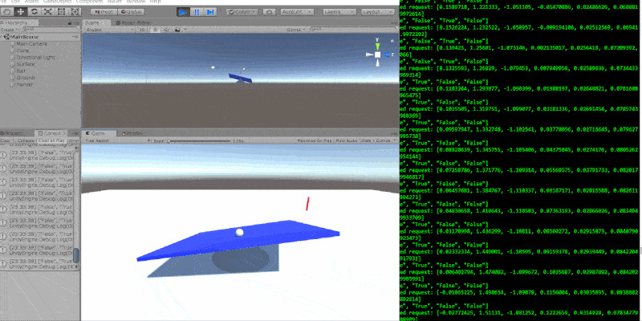

# Ball Balancer
This project uses Machine Learning (a simple version of behavioral cloning) to balance a ball on a freely moving 3D surface. The relevant details are in client (Unity3D Game) and tf-server folders. 

